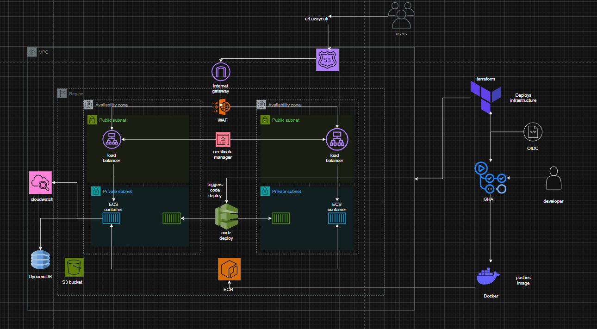

# Production-Ready-URL-Shortener-on-AWS-ECS-Fargate-DynamoDB-Terraform-CI-CD

## Overview
This project is a deployment of a URL shortener which takes URL's and shortens them and stores in DynamoDB.

This project runs on AWS ECS fargate, with an alb sitting in front to distribute traffics to services. It uses VPC endpoints to ensure that ECS service is not exposed to the internet

## Architecture diagram

# Infrastructure

The infrastructure is defined using Terraform. The code is located in the `terraform` directory. It includes the following resources:
- **VPC** with 2 public and priavte subnets across 2 AZ's
- **ALB** sitting in front of ecs services with **WAF** rules applied and **Route53** controlling our DNS
- **ECS Fargate** cluster with 2 services running our url shortener application
- **DynamoDB** table to store the shortened URLs
- **CloudWatch** for logging and monitoring
- **VPC Endpoints** to make sure traffic does not leave the VPC
- **Code deploy** as our deployment controller to allow for blue-green deployments
- **OIDC** roles created to allow access to GitHub actions
- **Cert-manager** for SSL/TLS encrypted traffic

## Application

## Docker

The application is containerized using Docker. The Dockerfile is located in the `app` directory. It uses a multi-stage build to optimise the image size.

- Uses **Distroless** image in runtime to minimise unneccessary files and packages and reduce surface for attacks
- Runs as **non-root user** to prevent sudo access if container is attaacked
- **Multi-stage** build to optimise image size and copy only necessary files and packages for runtime

## CICD

The CI/CD pipeline is defined using GitHub Actions. The workflow file is located in the `.github/workflows` directory. It includes the following steps:
- **Build** the Docker image and push to ECR
- **Deploy** the application using CodeDeploy with blue-green deployment strategy
- **TF-plan** shows what resources terraform is going to create
- **TF-apply** applies the terraform code to create the infrastructure, runs when a successful plan has been run
- **TF-destroy** takes down infrastructure

## Blue green deployment

## Security and cost optimisation

- **ECS** in private subnets with no access to internet
- **VPC endpoints** to remove cost of nat gateway and also tighten security by keeping all traffic inside **VPC**
- **WAF** rules to protect against common web attacks
- **CloudWatch** for monitoring and alerting
- **Destroy pipeline**   so we can tear down our infrastructure to prevent extra costs

## Conclusion
This project demonstrates how to build a production-ready URL shortener using AWS ECS Fargate, DynamoDB, and Terraform. It includes best practices for security, cost optimisation, and CI/CD. The architecture is designed to be scalable, secure, and maintainable.
